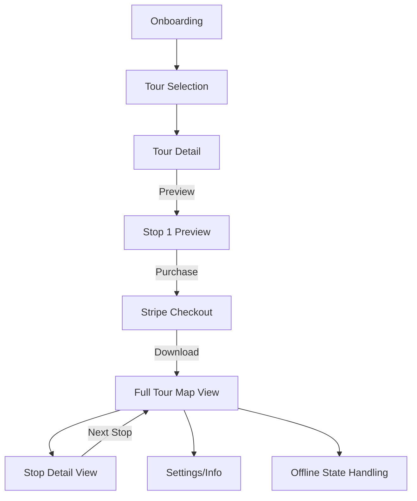

# app_flow_pages_and_roles.md

## Overview

This document describes the **core user flows**, app screens, navigation structure, and all user roles for the Step Into MVP.  
It maps every state from first entry to tour completion, including offline/online logic, preview and purchase gates, and admin/QA controls.  
All users are anonymous—no sign-in, no profile.

---

## User Roles

- **Tourist (Anonymous User)**
    - No login, anonymous ID stored locally on device.
    - Can preview tours, purchase/unlock, and use content offline.
- **Admin/QA (Dev/Test Builds Only)**
    - Hidden debug mode to unlock content, reset state, or simulate events.
    - Not accessible in production.

---

## App Pages & Flows

### 1. Onboarding Carousel

**Purpose:** Welcome and quickly orient the user.

- **Components:**  
  - 3–4 full-screen slides:  
    - “Step Into Cobh”
    - “Explore at your own pace”
    - “Self-guided, story-rich, offline-ready”
    - Final slide: “Start Exploring” (CTA)
  - Buttons: “Skip”, “Continue”

- **Logic:**  
  - Shown only on first launch or after reset.
  - Skipped after a successful first session.

---

### 2. Tour Selection Screen

**Purpose:** Entry hub for available tours.

- **Components:**  
  - Town name (e.g., “Cobh”)
  - Tour card:  
    - Name, summary, metadata (duration, stops, accessibility)
    - Hero image, CTA: “View Tour Details”

- **Logic:**  
  - If only one tour live (MVP), show directly—other towns as “coming soon” with disabled cards.

---

### 3. Tour Detail Screen

**Purpose:** Describe tour, show stops, preview, and unlock.

- **Components:**  
  - Tour name, hero image, long description
  - List/teaser of stops (Stop 1 shown, others locked/blurry)
  - Notice if multi-language available (MVP: English only)
  - CTAs:
    - “Preview Stop 1”
    - “Unlock Tour for €6.99” (if not yet purchased)
    - “Resume Tour” (if purchased)

- **Logic:**  
  - If offline and not downloaded, prompt to reconnect.

---

### 4. Stop 1 Preview Screen

**Purpose:** Free preview of first stop.

- **Components:**  
  - Stop 1 title, text, image, “You are here” pin on map
  - Locked/blurred remaining stops
  - CTA: “Enjoying this? Unlock 7 more stops to complete the tour.”
  - Button: “Buy Tour” (triggers Stripe Checkout)

- **Logic:**  
  - Only Stop 1 fully visible.
  - Purchase unlocks rest of tour.

---

### 5. Purchase & Download Flow

**Purpose:** Unlock full tour and assets.

- **Components:**  
  - Stripe Checkout (webview)
  - Download progress indicator
  - Toast on completion: “Your tour is ready offline.”

- **Logic:**  
  - After purchase, app downloads all stops, images, audio, and offline map tiles.
  - Resume/retry if interrupted.

---

### 6. Full Tour Map View (Post-Purchase)

**Purpose:** Main navigation and discovery view.

- **Components:**  
  - Interactive map (Mapbox/MapLibre), all stop pins, optional path overlay
  - “You are here” indicator (if GPS allowed)
  - Tap pins to open stop detail
  - Visual tour progress

- **Logic:**  
  - Pre-purchase: only Stop 1 tappable
  - Post-purchase: all stops unlocked
  - Fully offline after download

---

### 7. Stop Detail View (Unlocked)

**Purpose:** View rich content at each stop.

- **Components:**  
  - Title, full text, image, (optional) audio or links
  - “Next Stop” and “Back to Map” buttons

- **Logic:**  
  - Only unlocked stops accessible
  - Downloaded content always available offline

---

### 8. Settings / Info Screen

**Purpose:** App meta and non-critical actions.

- **Components:**  
  - Language toggle (disabled in MVP)
  - FAQ, privacy policy, app version
  - Placeholder for “Restore Purchases” (future)

---

### 9. Offline State Handling

**Purpose:** Graceful handling of no connectivity.

- **Components:**  
  - Banner/message if not connected
  - “You’re offline—please connect to access this tour.”
  - Retry or fallback flows

- **Logic:**  
  - All downloaded tours/stops usable offline
  - New downloads/Stripe require connection

---

### 10. Admin QA Mode (Dev/Test Builds Only)

**Purpose:** Internal testing & metrics validation.

- **Components:**  
  - Unlock any tour, reset purchase state, trigger metrics events
  - Accessed via hidden gesture or config

---

## App Flow Diagram (Linear MVP)

---

## Navigation Patterns
- Tab-less, linear flows with direct transitions
- CTAs always visible—never hidden in menus
- Minimal steps: onboarding → preview → purchase → start tour in 1–2 taps

---

## State Transitions
- First Launch: Onboarding → Tour Selection
- Returning User: Tour Selection → (if purchased) Full Tour Map View
- Offline Launch: Previously downloaded content only; prompt for connection if not downloaded
- App Reset: Onboarding shown again, device/user ID regenerated

---

## Out of Scope for MVP
- No user accounts, no login/logout
- No multi-role support (tourist only)
- No tour sharing, gifting, or feedback popups during tours
- No multi-town navigation grid (other towns = “coming soon”)

---

## Notes
- All navigation and user state are designed for simplicity and clarity; no nested menus or ambiguous flows.
- Admin/QA flows must never leak into production releases.
- All user roles are anonymous by design.

